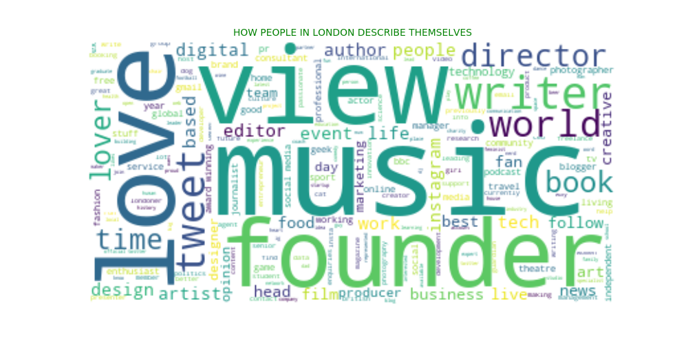
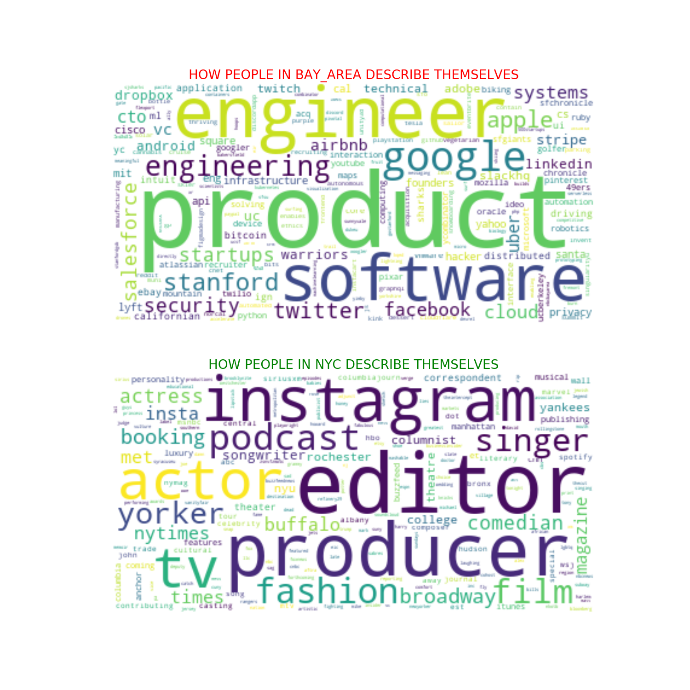
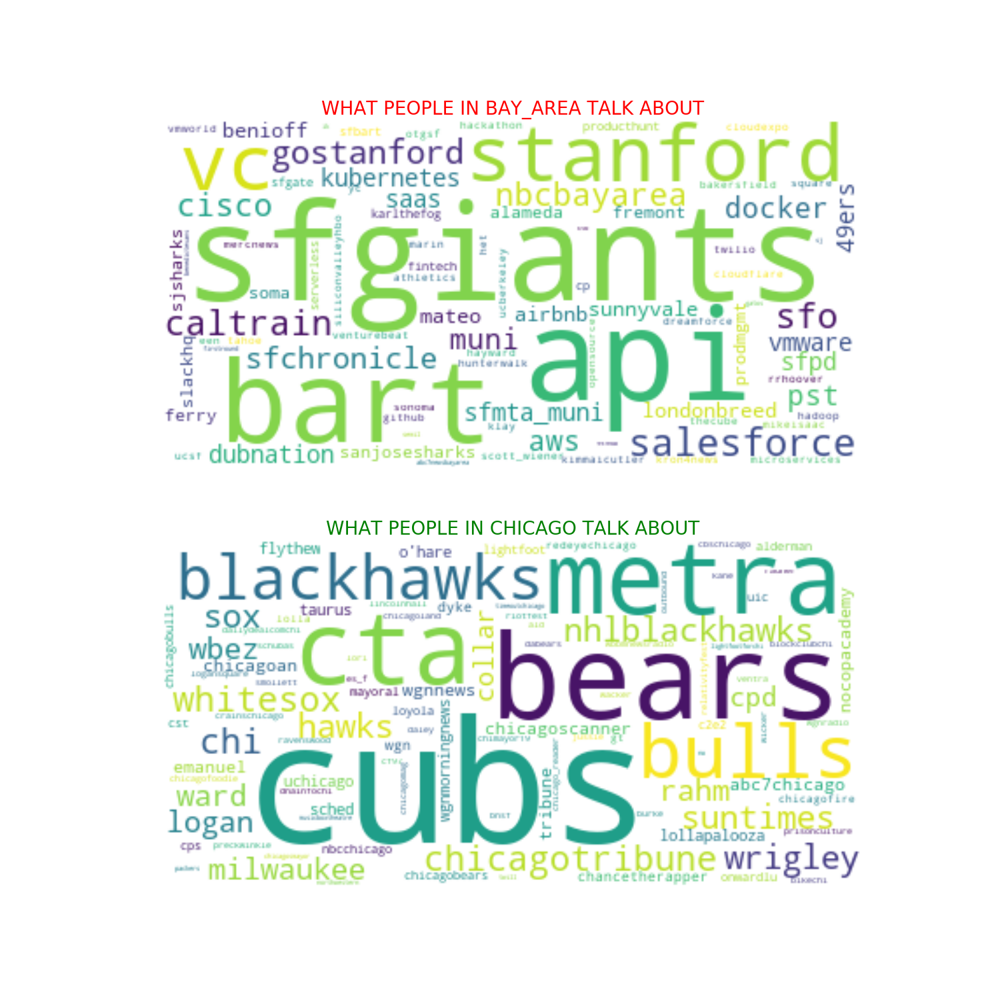
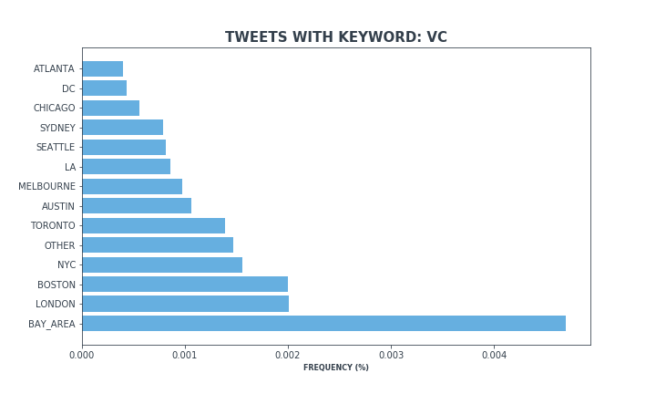
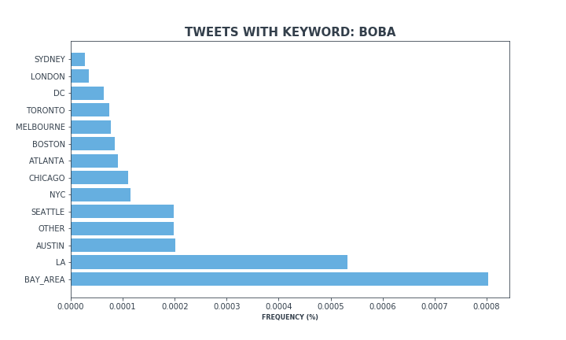
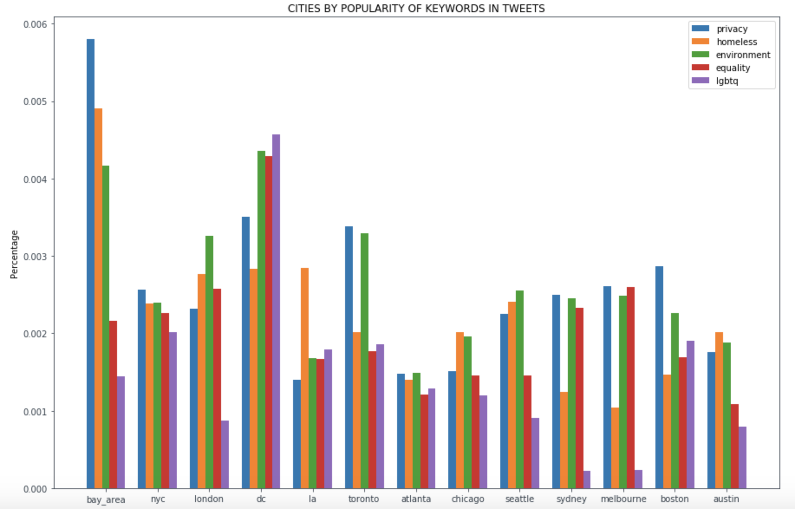
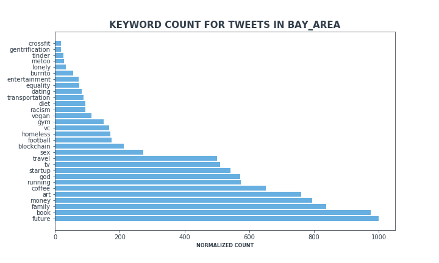
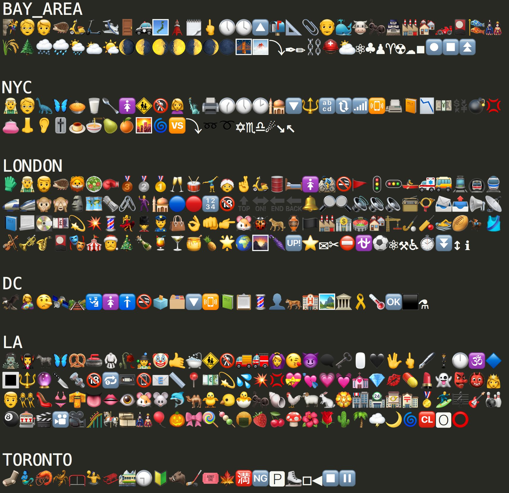
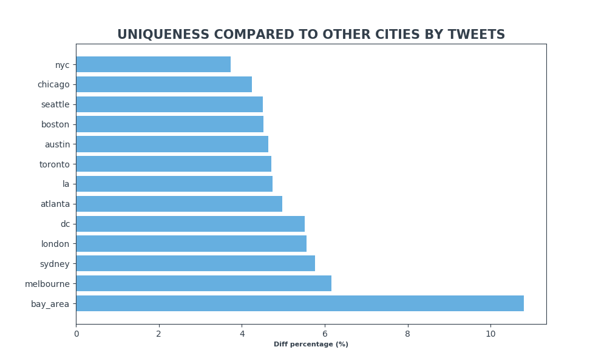
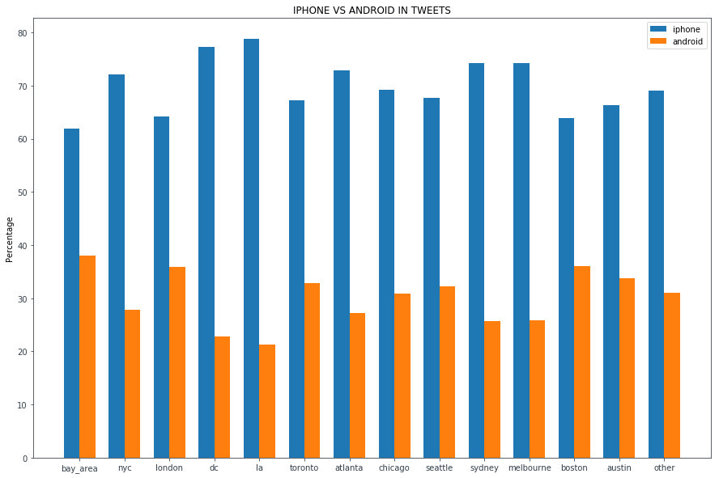

# Indian Twitter

This is an unofficial fork of the MetroTwitter.

About the MetroTwitter project:
- [code](https://github.com/chiphuyen/MetroTwitter) by @chiphuyen 
- blog: 
[MetroTwitter - What Twitter reveals about the differences between cities and the monoculture of the Bay Area](https://huyenchip.com/2019/05/28/metrotwitter.html)
- visualizations: download [here](https://drive.google.com/drive/folders/1B3rQeBhB50kdOCyNtwRhU26jO-F7VJAo?usp=sharing).

Analysis of Twitter data in 13 English-speaking metropolitan areas (96K users and 180M tweets).

## How people in different cities describe themselves
In the ``metrotwitter_visualization`` folder, you can find word clouds that represent the most popular words in bios in each city. The ``indi`` folder visualizes each city independently. The ``duo`` folder visualizes the difference between two cities.

</img>
</img>

## What people in different cities talk about
In the ``metrotwitter_visualization`` folder, you can find word clouds that represent the most popular words in tweets in each city. The ``indi`` folder visualizes each city independently. The ``duo`` folder visualizes the difference between two cities.

</img>

## Ranking cities by popularity of keywords
In the ``keywords`` Jupyter notebook in this GitHub repo, there's the method ``rank_cities_by_keyword`` to visualize any keyword you want, either using ``bios`` or ``tweets``.

</img>
</img>

You can also plots multiple keywords on the same plot using the method ``rank_cities_by_multiple_keywords``. 

</img>

## Ranking keywords within a city
Also in the ``keywords`` Jupyter notebook, there's the method ``rank_keywords_in_city`` to rank the popularity of keywords within a city.

</img>

## Unique popular emojis in each city

</img>

## Most unique city
</img>

## Compare two keywords
Just to get a sense of how popular one vs another.
</img>
